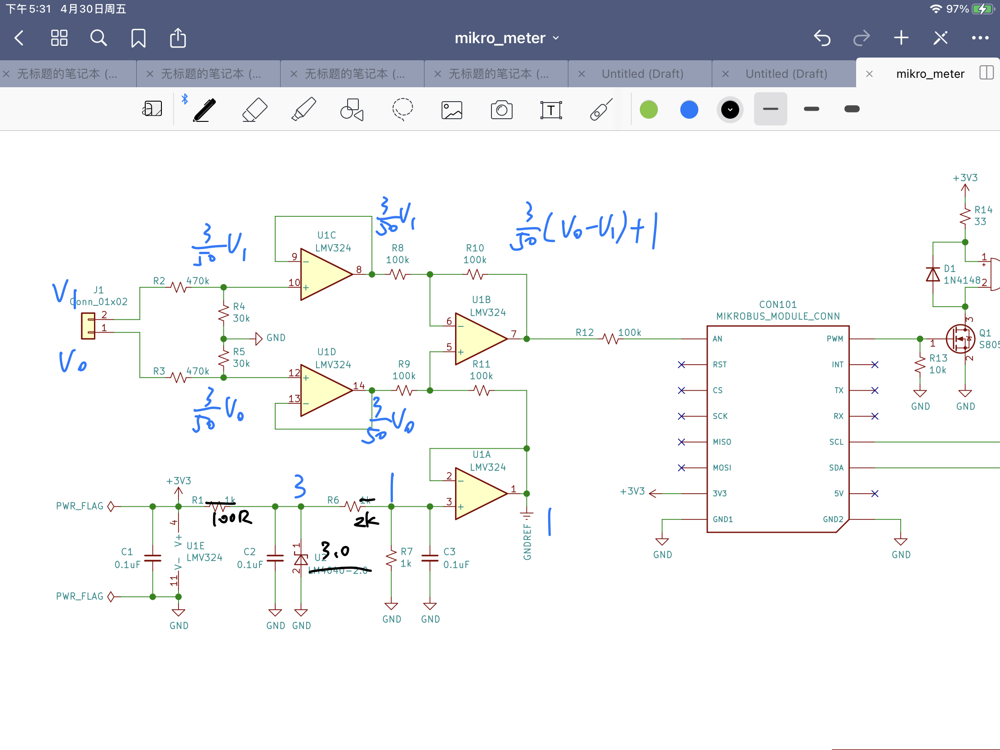
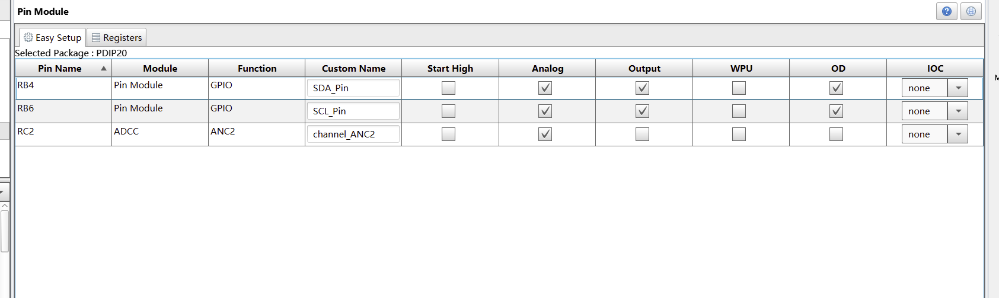
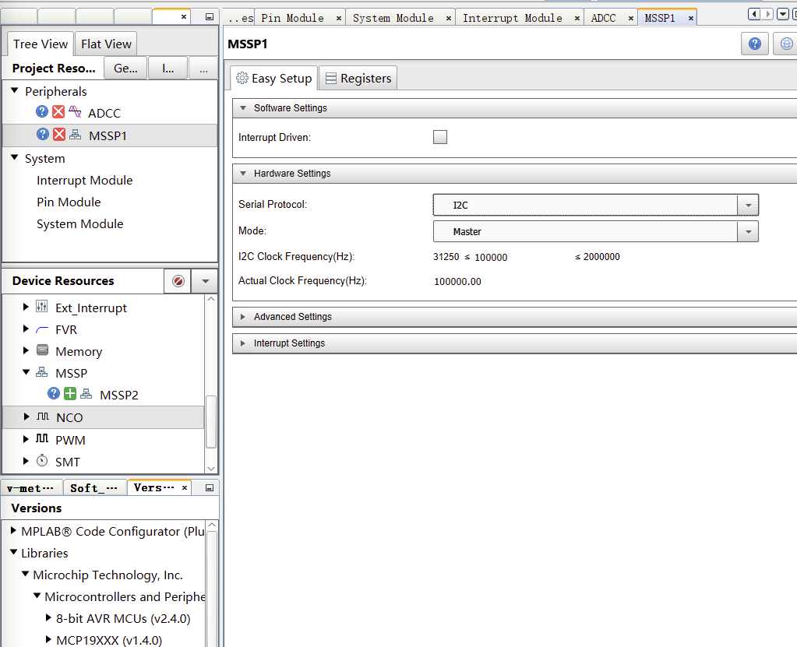
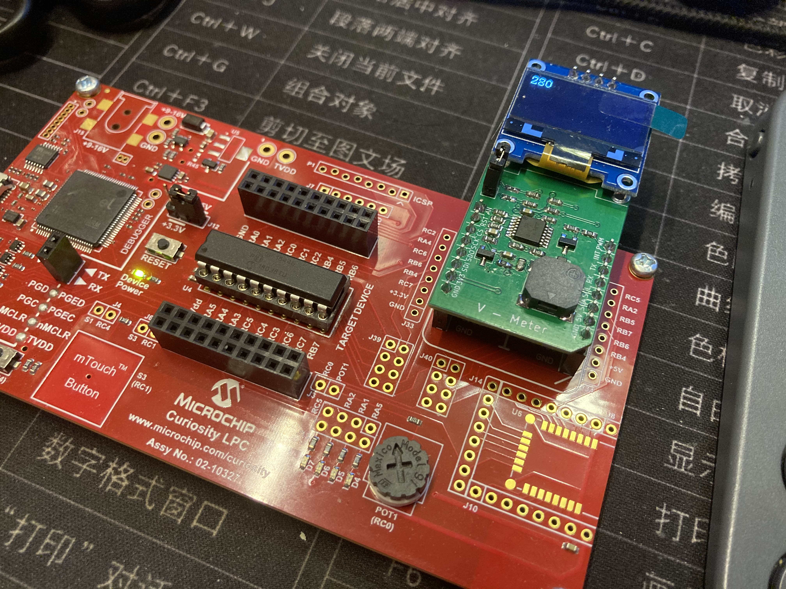
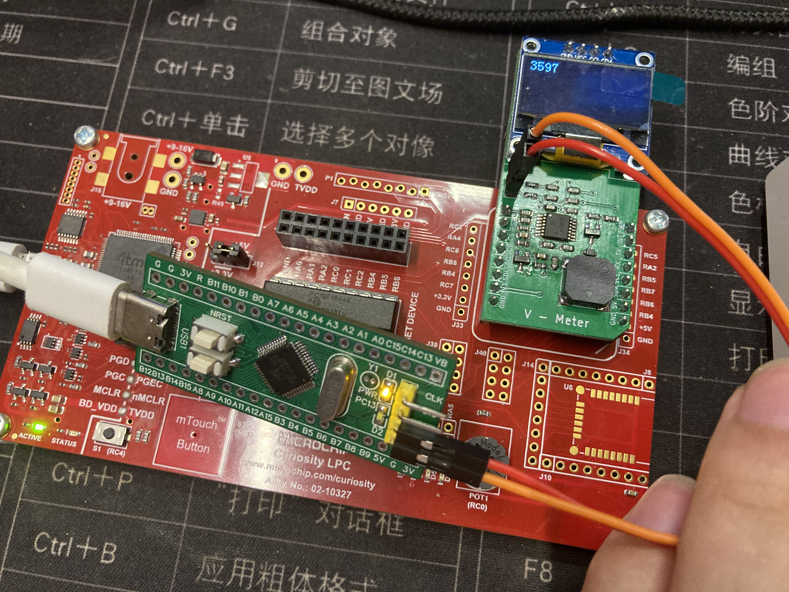
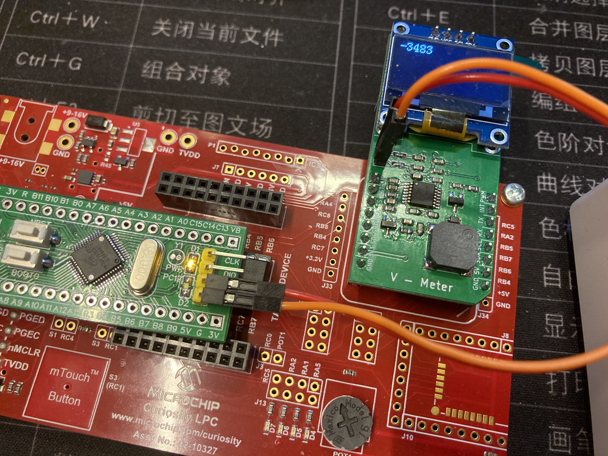

FunPack第七期苏老师直播绘制了一块MikroBus接口的扩展板，是一块电压测量的扩展板，并将其寄送到了参与FunPack第七期活动的朋友手中。当然，我也拿到了一块。我趁着51有空，调试使用了一番。

# 原理介绍

由于苏老师的直播重心放在绘制PCB，没有对原理图做一个过多的解释。当然，这个图学过模电的同学都能看懂，就是几个电压跟随器和一个加减器。在这里我放上我推导出来每个点的电位（蓝色）。黑色是由于近期芯片缺货而更换的物料及周边电路。



# 主要代码及讲解

## 管脚配置

按照原理图，我们只需要配置一个ADC管脚和两个I2C管脚。I2C由于我暂时使用模拟方式实现，所以暂时分配为GPIO。感兴趣的小伙伴可以试试I2C外设，在MCC左侧选择Device Resources - MSSP，Serial Protocol选择I2C。






## OLED模块

OLED使用了我自己的[祖传驱动](https://github.com/kaidegit/HWDrivers4MCU/tree/main/OLED_SSD1306_i2c)，由于没看懂PIC库中的I2C函数的使用（一堆函数放在.c文件是什么鬼啊），这里暂时使用模拟I2C代替，同样也是我自己的[祖传代码](https://github.com/kaidegit/HWDrivers4MCU/tree/main/Soft_I2C)。几个接口函数如下：

```c++
void oled_send(uint8_t dc, uint8_t data){
    Soft_I2c_Send(OLED_ADDR, dc, data);
}

#define Delay_us(x) __delay_us(x)

void SDA_Set() {
    SDA_Pin_SetHigh();
}
void SDA_Reset() {
    SDA_Pin_SetLow();
}
bool ReadSDAState(){
    // SDA脚配置为开漏输出，可直接被下拉，读IO电平
    return SDA_Pin_GetValue();
}
/* SCL与之类似，省略 */
```

## 电压的计算

可以根据原理及ADC的基准电压推出电压公式

```c++
        adcValue = ADCC_GetSingleConversion(channel_ANC2);
        voltage = ((adcValue + 1) / 4096.0 * 5000 - 1000) * 50 / 3.0;
```

## main函数总览

（只是个demo，写的较为随意）

```c++
void main(void)
{
    uint16_t adcValue;
    float voltage;

    SYSTEM_Initialize();
    __delay_ms(200); // 等待OLED启动
    OLED_Init();
    OLED_Clear();

    while (1)
    {
        adcValue = ADCC_GetSingleConversion(channel_ANC2);
        voltage = ((adcValue + 1) / 4096.0 * 5000 - 1000) * 50 / 3.0;
        OLED_ShowString(0,0,"      ",16);
        OLED_ShowNum(0, 0, (int32_t)voltage, 16);
        __delay_ms(500);
    }
}
```

# 效果展示

实际效果可能并不如推断的那么好。LM324也存在着零飘和输入电阻，电阻也并不是想象中的那么精确，ADC仅采集一次而不做滤波处理也会导致各种抖动。要想得到更佳的数据，可能需要对数据进行进一步的处理。

## 0V测试



## 3.3V测试



## -3.3V测试




